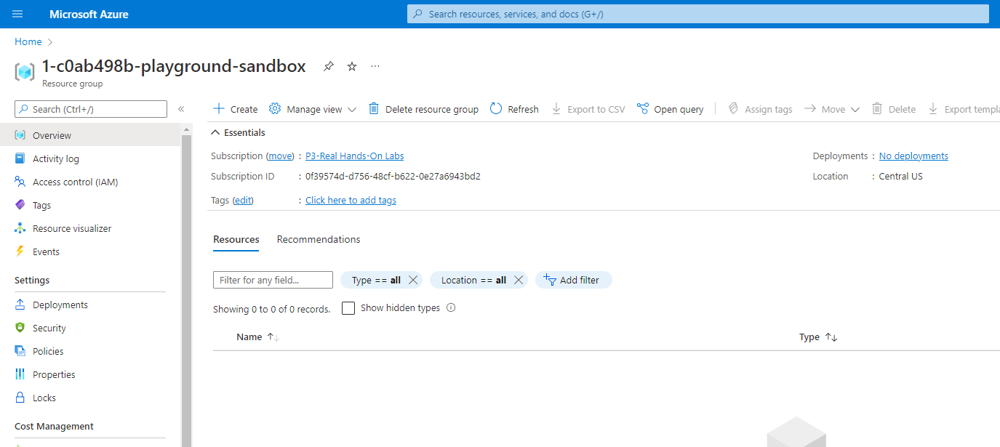
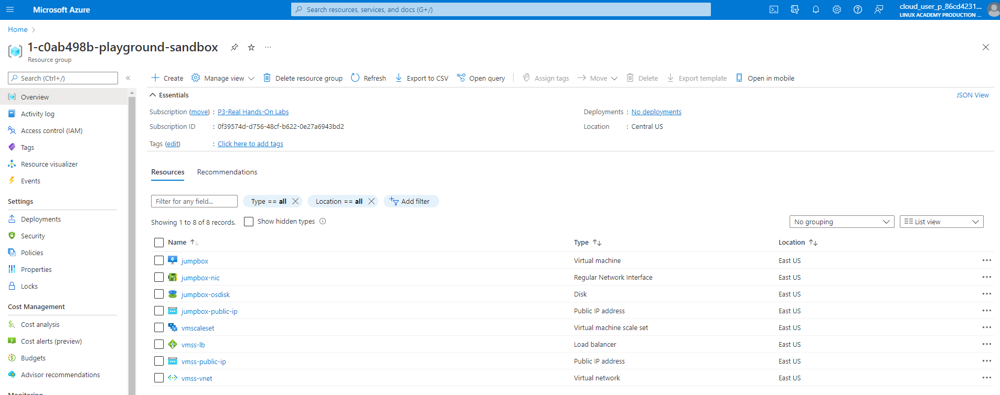
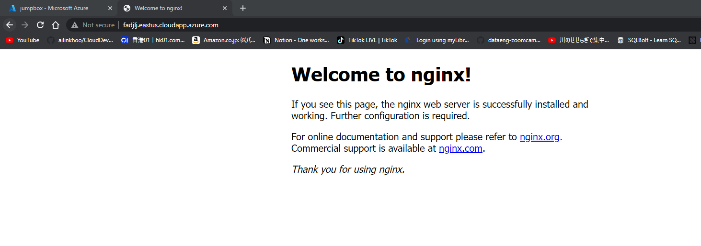

1. Open acloudguru Cloud playground -> Azure sandbox and copy username and password. 
2. Type in command line for authentication: `az login -u cloud_user_p_86cd4231@azurelabs.linuxacademy.com` and password

    ```
    $ az login -u cloud_user_p_86cd4231@azurelabs.linuxacademy.com
    Password:
    [
    {
        "cloudName": "AzureCloud",
        "homeTenantId": "3617ef9b-98b4-40d9-ba43-e1ed6709cf0d",
        "id": "0f39574d-d756-48cf-b622-0e27a6943bd2",
        "isDefault": true,
        "managedByTenants": [],
        "name": "P3-Real Hands-On Labs",
        "state": "Enabled",
        "tenantId": "3617ef9b-98b4-40d9-ba43-e1ed6709cf0d",
        "user": {
        "name": "cloud_user_p_86cd4231@azurelabs.linuxacademy.com",
        "type": "user"
        }
    }
    ]
    ```
3. Change working directory to `scale-sets` folder. There are 4 files: `main.tf`, `variables.tf`, `output.tf`, `web.conf`.
4. Change the resource group name in `variables.tf`
    ```
    variable "resource_group_name" {
    description = "Name of the resource group in which the resources will be created"
    default     = "1-c0ab498b-playground-sandbox"
    }
    ```
Copy the name from azure portal. 


    
5. Run `terraform init`
6. Run `terraform plan` 
    enter password for admin account: Ailin123!
7. Run `terraform apply`

```
Outputs:

jumpbox_public_ip = "20.119.32.199"
jumpbox_public_ip_fqdn = "fadjlj-ssh.eastus.cloudapp.azure.com"
vmss_public_ip_fqdn = "fadjlj.eastus.cloudapp.azure.com"

```




**Additional tasks**:

1. Key in password in `variables.tf` to avoid password prompt in cmd line
```
variable "admin_password" {
   description = "Default password for admin account"
   default = "Ailin123!"
}
```
2. Change the image of server 

Ref: https://docs.microsoft.com/en-us/azure/virtual-machines/linux/cli-ps-findimage#list-popular-images

```
$ az vm image list --output table
You are viewing an offline list of images, use --all to retrieve an up-to-date list
Offer                         Publisher               Sku                 Urn
                  UrnAlias             Version
----------------------------  ----------------------  ------------------  --------------------------------------------------------------  -------------------  ---------
CentOS                        OpenLogic               7.5                 OpenLogic:CentOS:7.5:latest
                  CentOS               latest
debian-10                     Debian                  10                  Debian:debian-10:10:latest
                  Debian               latest
flatcar-container-linux-free  kinvolk                 stable              kinvolk:flatcar-container-linux-free:stable:latest              Flatcar              latest
openSUSE-Leap                 SUSE                    42.3                SUSE:openSUSE-Leap:42.3:latest
                  openSUSE-Leap        latest
RHEL                          RedHat                  7-LVM               RedHat:RHEL:7-LVM:latest
                  RHEL                 latest
SLES                          SUSE                    15                  SUSE:SLES:15:latest
                  SLES                 latest
UbuntuServer                  Canonical               18.04-LTS           Canonical:UbuntuServer:18.04-LTS:latest                         UbuntuLTS            latest
WindowsServer                 MicrosoftWindowsServer  2019-Datacenter     MicrosoftWindowsServer:WindowsServer:2019-Datacenter:latest     Win2019Datacenter    latest
WindowsServer                 MicrosoftWindowsServer  2016-Datacenter     MicrosoftWindowsServer:WindowsServer:2016-Datacenter:latest     Win2016Datacenter    latest
WindowsServer                 MicrosoftWindowsServer  2012-R2-Datacenter  MicrosoftWindowsServer:WindowsServer:2012-R2-Datacenter:latest  Win2012R2Datacenter  latest
WindowsServer                 MicrosoftWindowsServer  2012-Datacenter     MicrosoftWindowsServer:WindowsServer:2012-Datacenter:latest     Win2012Datacenter    latest
WindowsServer                 MicrosoftWindowsServer  2008-R2-SP1         MicrosoftWindowsServer:WindowsServer:2008-R2-SP1:latest         Win2008R2SP1         latest
```


Resouces: https://docs.microsoft.com/en-us/azure/developer/terraform/create-vm-scaleset-network-disks-hcl