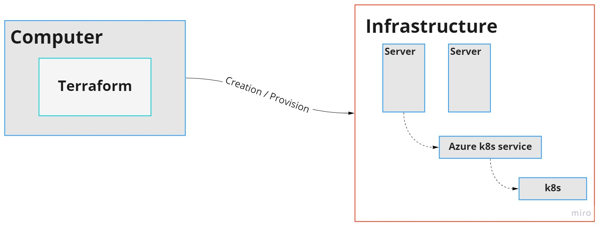
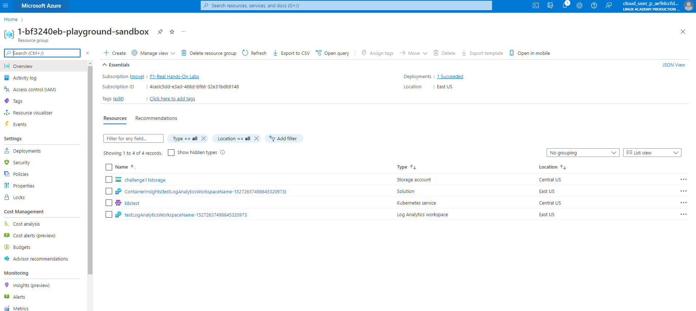
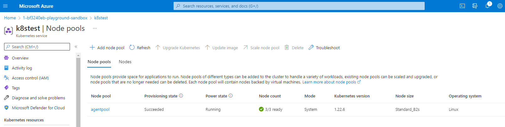

Reference: https://docs.microsoft.com/en-us/azure/developer/terraform/create-k8s-cluster-with-tf-and-aks

Reference: https://docs.microsoft.com/en-us/azure/aks/intro-kubernetes


## Create a Kubernetes cluster with Azure Kubernetes Service using Terraform



1. az login -u cloud_user_p_ae9dccfd@azurelabs.linuxacademy.com

2. change variable `resource_group_name` to `1-bf3240eb-playground-sandbox`

3. Configure Azure storage to store Terraform state by follow [step 2](https://docs.microsoft.com/en-us/azure/developer/terraform/create-k8s-cluster-with-tf-and-aks#2-configure-azure-storage-to-store-terraform-state). 

4. To create an [SSH](https://docs.microsoft.com/en-us/azure/virtual-machines/linux/ssh-from-windows#create-an-ssh-key-pair) key pair on your local computer using the ssh-keygen command from PowerShell or a command prompt, type the following:

    `ssh-keygen -m PEM -t rsa -b 2048`

5. Initialize.

    `terraform init`

6. Run terraform plan to create an execution plan.

    `terraform plan -out main.tfplan`

7. Run terraform apply to apply the execution plan to your cloud infrastructure.

      `terraform apply main.tfplan`



8. Change node pool and node size

    Change in k8s.tf

- Change node size

```
  default_node_pool {
    name       = "agentpool"
    node_count = var.agent_count
    vm_size    = "Standard_B2s"
  }
```



- Change node count 

```
  variable "agent_count" {
    default = 4 #Change node count here
```
