>[Back to Index](README.md)

### Table of contents
- [DevOps Theory and Practice](#devops-theory-and-practice)
  - [DevOps Culture](#devops-culture)
  - [DevOps Concepts and Practices](#devops-concepts-and-practices)
- [Source Control and Git](#source-control-and-git)
  - [The Basics of Using Git](#the-basics-of-using-git)
  - [Tags, Branching, Merging and Reverting](#tags-branching-merging-and-reverting)
- [Containerization with Docker](#containerization-with-docker)

# DevOps Theory and Practice

## DevOps Culture

- [What is DevOps - AWS](https://aws.amazon.com/devops/what-is-devops/)

- [DevOps Life Cycle of Application](https://github.com/MichaelCade/90DaysOfDevOps/blob/main/Days/day05.md)

## DevOps Concepts and Practices

- **Build Automation**: automation of the process of preparing code for deployment to a live environment. Depending on what languages are used, code needs to be compiled, linted, minified, transformed, 
unit tested, etc. Build automation means taking these steps and doing them in a consistent, automated way using a script or tool.

- **[Continuous Integration](https://webapp.io/blog/what-is-ci/)**: the practice of frequently merging code changes done by developers

- **[Continuous Delivery and Continuous Deployment](https://github.com/MichaelCade/90DaysOfDevOps/blob/main/Days/day70.md)**
  
  - Continuous Delivery: the practice of continuously maintaining code in a deployable state
  - Continuous Deployment: the practice of frequently deploying small code changes to production

- **[Infrastructure as Code](https://github.com/MichaelCade/90DaysOfDevOps/blob/main/Days/day56.md)**: manage and provision infrastructure through code and automation.

  Without infrastructure as code you might:
  - ssh into a host
  - Issue a series of commands to perform the change
  
  With infrastructure as code:
  - Change some code or configuration files that can be used with an automation tool to perform changes 
  - Commit them to source control
  - Use an automation tool to enact the changes defined in the code and/or configuration files

- **Configuration Management**: maintaining and changing the state of pieces of infrastructure in a consistent, maintainable, and stable way. Configuration management allows you to minimize configuration drift – the small changes that accumulate over time and make systems different from one another and harder to manage. 

- **Orchestration**: automation that supports processes and workflows, such as provisioning resources.

  - *Scalability* – Resources can be quickly increased or decreased to meet changing needs.
  - *Stability* – Automation tools can automatically respond to fix problems before users see them.
  - *Save time* – Certain tasks and workflows can be automated, freeing up engineers’ time.
  - *Self-service* – Orchestration can be used to offer resources to customers in a self-service fashion.
  - *Granular insight into resource usage* – Orchestration tools give greater insight into how many resources 
  are being used by what software, services, or customers.

- **Monitoring**: The collection and presentation of data about the performance and stability of services and infrastructure. Organizations monitor metrics and logs to see how application and infrastructure performance impacts the experience of their product’s end user. Monitoring tools collect data over things such as:
usage of memory, cpu, disk i/o, application logs, network traffic.

- **Microservices**: The microservices architecture is a design approach to build a single application as a set of small services. Microservices are loosely coupled: Different microservices interact with each other using stable and 
well-defined APIs. 

  - *Modularity* – Microservices encourage modularity. In monolithic apps, individual pieces become tightly coupled, and complexity grows. Eventually, it’s very hard to change anything without breaking something. 

  - *Technological flexibility* – You don’t need to use the same languages and technologies for every part of the app. You can use the best tool for each job.

  - *Optimized scalability* – You can scale individual parts of the app based upon resource usage and load. With a monolith, you have to scale up the entire application, even if only one aspect of the service actually needs to be scaled.


### Create a DevOps Pipeline

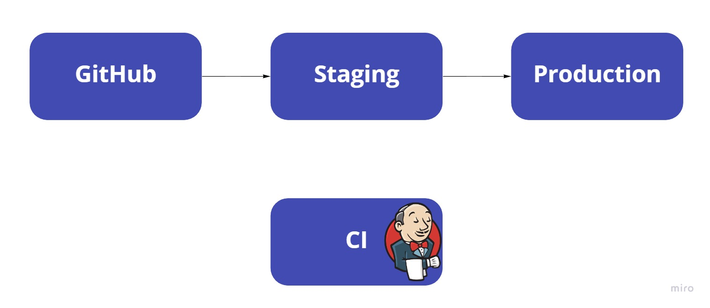


1. **GitHub** (source control repository) is where the application code is stored.

2. **Staging Server** (Test Server) where we deploy our code to ensure the deployment works before going into Production Server.

3. **Continuous Integration**, CI Server is using Jenkins to orchestrate the process. It will take the code from GitHub and deploy to Staging and then to Production.

**Execute the Initial Deployment**
Set up a Continuous Integration server by configuring the Jenkins project to look at the GitHub repo. 
Click Configure -> Branch Sources -> Project Repository to the GitHub repo URL -> Save

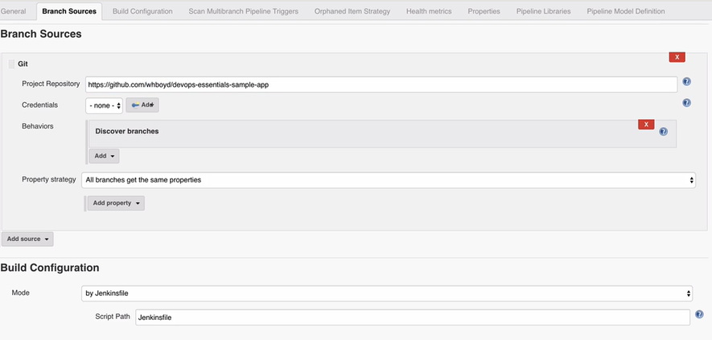

We will see Jenkins is scanning and building the branches from the repo.

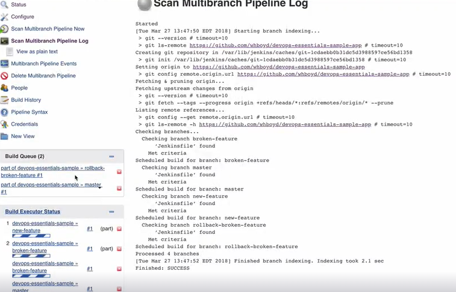


Master branch represents code that is ready to be deployed to production. 


**Create a Pull Request**

On the production webpage, it is shown DevOps is great.

Back in GitHub, next to the new-feature branch, click New pull request. We need to merge the new feature branch into the master branch. 

Set the base fork: personal fork.

Set the base dropdown: master branch.

Set the compare dropdown: new-feature.

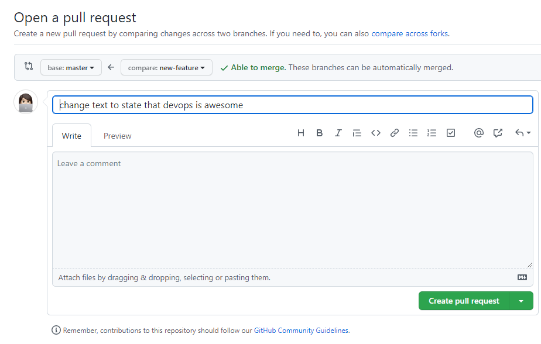

Below you will see the changes are displayed in a code comparison. Once ready, select Create pull request.

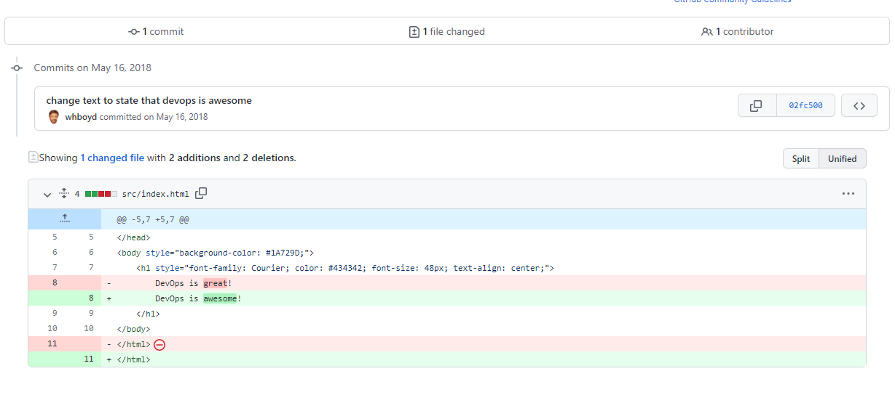

Select Merge pull request, and then Confirm merge.

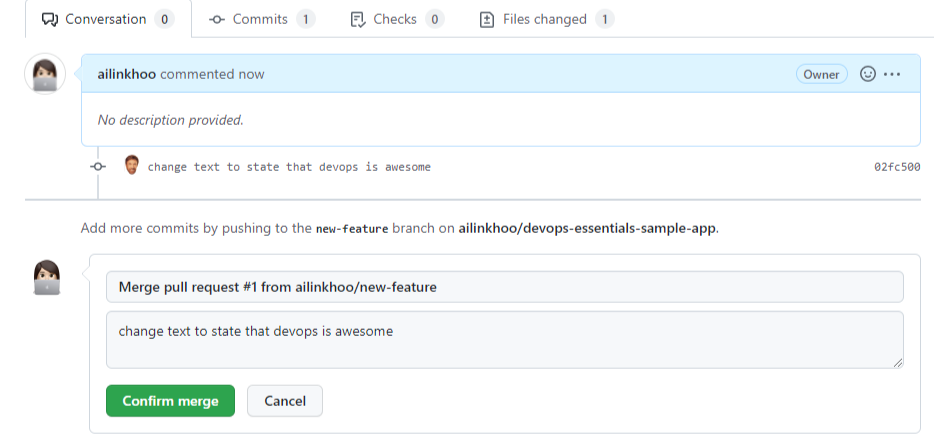

Back in the Jenkins server, devops-esentials-sample -> master
On the new page, select build now from the sidebar. A new build will begin. *Build* is doing the build automation, *DeployToStage* deploys to staging server. When it gets to the *DeployToProd* stage, it will pause and wait for our input.

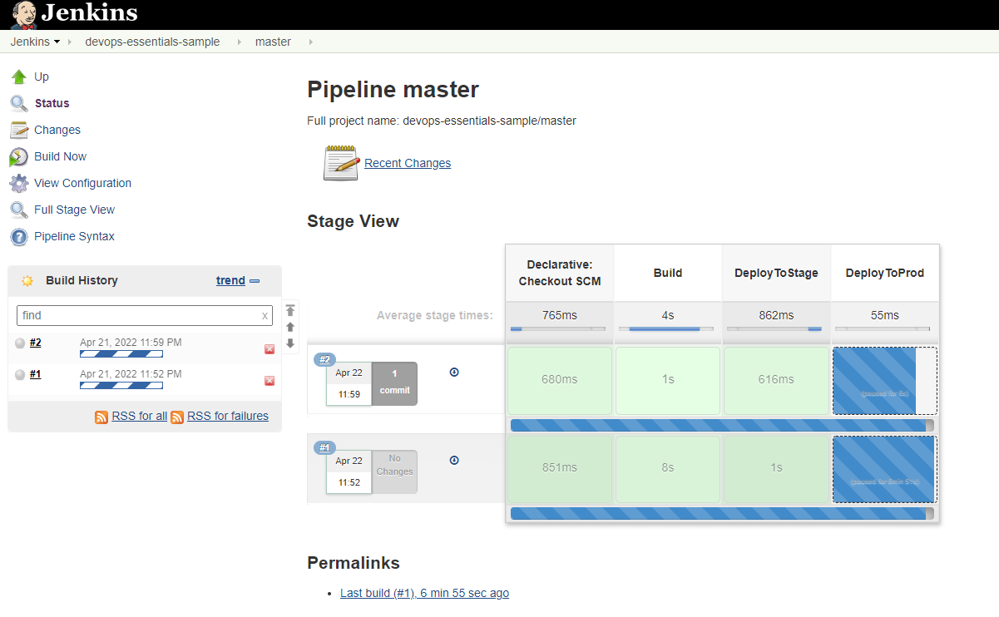 

Check the staging webserver, we should see a page that says DevOps is awesome, which means the code pull is working correctly.

Back in the Jenkins window, hover over the *DeployToProd* and click Proceed.

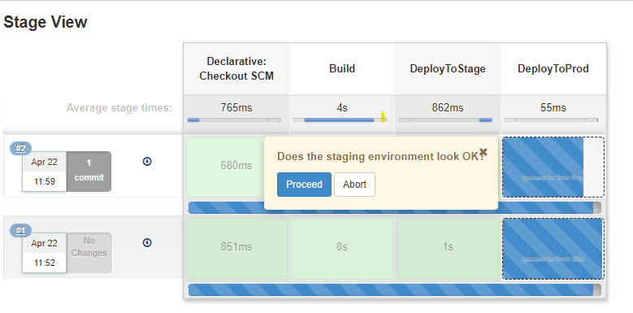 

Refresh our tab for the production webserver and we should see the updated text.

**Run the "Broken" Deployment**

Back on GitHub, click New pull request for the broken-feature branch.

Set the base fork: personal fork.

Set the base dropdown: master branch.

Set the compare dropdown: broken-feature.

Click Create pull request -> Merge pull request -> Confirm merge.

Back in the Jenkins tab, click Build Now. Once it gets to the DeployToProd stage, hover over that section and select Proceed. Refresh the tab with the production webserver. We should see a misspelled word.

**Roll Back the Broken Deployment**

Back on the Jenkins page, click on build #2 -> Replay -> Run
On the Jenkins page, hover over the DeployToProd section, and select Proceed.
Once updated, our production webserver will show the correct text, meaning we have performed a successful rollback.

 

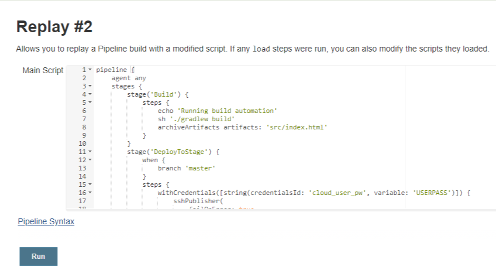 

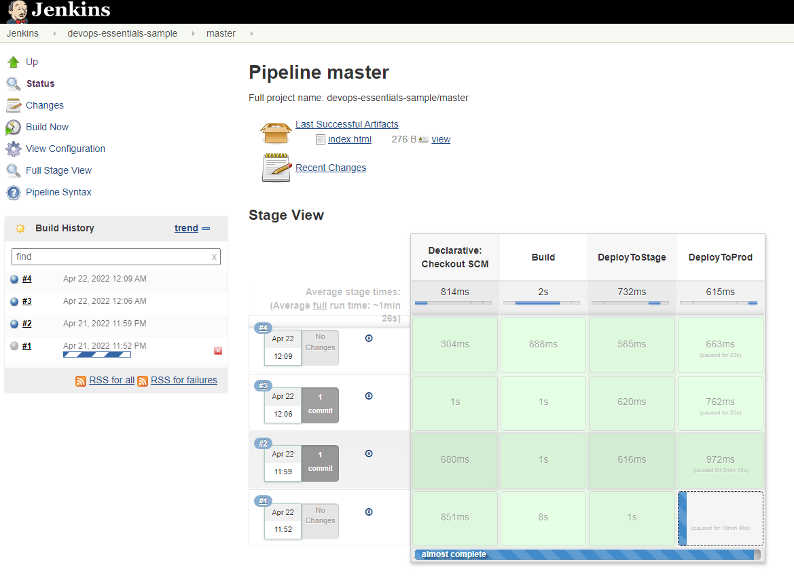 

# Source Control and Git

## The Basics of Using Git 

- Git is a version control system.
- Git helps you keep track of code changes.
- Git is used to collaborate on code.

### Understanding the Git File System

`.git` is a hidden directory that is created when the current directory is transformed into a Git repository. It contains the configuration
information about our repository and all of the tracking information about all the files within the project directory.

`git add [filename]` selects that file, and moves it to the staging area, marking it for inclusion in the next commit.

A typical Git repository listing: 
```
Khoo Ai Lin@Ailin MINGW64 ~/Desktop/Cloud suport and devops/cloudpractice/devops/intake5_git_demo_fork (main)
$ ls .git/
COMMIT_EDITMSG  config  description  FETCH_HEAD  HEAD  hooks/  index  info/  logs/  objects/  packed-refs  refs/
```

### Creating a Local Repository

`git init`: initialize a new Git repository 

`git init --bare`: Create a new bare repository (a repository to be used as a remote repository only, that won't contain active development)

```
Khoo Ai Lin@Ailin MINGW64 ~/Desktop/Cloud suport and devops/cloudpractice/devops (main)
$ git init --bare big_project.git
Initialized empty Git repository in C:/Users/Khoo Ai Lin/Desktop/Cloud suport and devops/cloudpractice/devops/big_project.git/

Khoo Ai Lin@Ailin MINGW64 ~/Desktop/Cloud suport and devops/cloudpractice/devops (main)
$ ls -a big_project.git/
./  ../  config  description  HEAD  hooks/  info/  objects/  refs/
```

All of the repository information is in the root of this directory instead of `.git`. 

`git clone [url]`: Clone (download) a repository that already exists on GitHub, including all of the files, branches, and commits.

`git remote -v`: Show the associated remote repositories and their stored name, like origin.

```
$ git remote -v
origin  https://github.com/ailinkhoo/intake5_git_demo.git (fetch)
origin  https://github.com/ailinkhoo/intake5_git_demo.git (push)
upstream        https://github.com/ytbryan/intake5_git_demo.git (fetch)
upstream        https://github.com/ytbryan/intake5_git_demo.git (push)
```
### Basic Configuration of Git

There are two main settings that you will need to have in place for your Git environment, and they are your name and your email address.
These particular settings are not used for any type of authentication mechanism. They are just used to add information to track who made changes to files. This is known as setting up your identity.

`$ git config --global user.name "[name]"`: Sets the name you want attached to your commit transactions

`$ git config --global user.email "[email address]"`: Sets the email you want attached to your commit transactions

`git config --list`: view configuration information for the git environment

```
Khoo Ai Lin@Ailin MINGW64 ~/Desktop/Cloud suport and devops/cloudpractice/devops/testing (master)
$ git config user.email "test@email.com"

Khoo Ai Lin@Ailin MINGW64 ~/Desktop/Cloud suport and devops/cloudpractice/devops/testing (master)
$ git config user.email
test@email.com

Khoo Ai Lin@Ailin MINGW64 ~/Desktop/Cloud suport and devops/cloudpractice/devops/testing (master)
$ cd

Khoo Ai Lin@Ailin MINGW64 ~ (main)
$ git config user.email
ailinkhoo11@gmail.com

```
We will set up the email address that we want to be used when tracking changes to this project. Notice that we did not use the `--global` option here as we only wanted to change the email address for this particular project, we also needed to be in this project's working directory in order to make this change. We can test this by running the Git config command on email setting and here we see only the `test@email.com` address being used and if we go back to our home directory and check our email settings again, we see that Git will use the default one that we have set up in our global configuration file.

### Adding Files to a Project 

`git add [file]`: snapshots the file in preparation for versioning, adding it to the staging area. Tell Git what files to keep track of. 

`git status`: shows you what branch you're on, what files are in the working or staging directory, and any other important information.

```
$ git status
On branch master

No commits yet

Changes to be committed:
  (use "git rm --cached <file>..." to unstage)
        new file:   new-file
```
### The Status of Your Project

- `git status -s`: view the output in shortened format
- `A`: file has been added to the index
- `??`: file is not tracked
- `M`: file is modified
- `git status -v`: shows more "verbose" detail including the textual changes of any uncommitted files

```
$ git status
On branch master

No commits yet

Changes to be committed:
  (use "git rm --cached <file>..." to unstage)
        new file:   new-file
        new file:   new_file2

Untracked files:
  (use "git add <file>..." to include in what will be committed)
        new_file3

$ git status -s
A  new-file
A  new_file2
?? new_file3
```
```
$ echo "SPYXFAMILY is so good ~" > new-file

$ git status -s
AM new-file
A  new_file2
?? new_file3

```
### Committing to Git 

Commits are the building blocks of "save points" within Git's version control. 

`git commit -m "<MESSGAE>"`: performs a commit with a specific message.

`git commit -am <MESSGAE>"`: In addition to including the commit message, this option allows you to skip the staging phase. The addition of `-a` will automatically stage any files that are already being tracked by Git (changes to files that you've committed before).

Git will take the first two characters of the SHA 1 hash value and create a directory under the objects directory.

```
$ git log
commit 9ff2aae193175fca3119c2cb9d65eb51f1f4005e (HEAD -> master)
Author: khooailin <test@email.com>
Date:   Mon Apr 25 22:55:19 2022 +0800

    Update to new_file3

commit 684f1e8377a91dcbf6f352cb5fe77a4a5af28263
Author: khooailin <test@email.com>
Date:   Mon Apr 25 22:54:35 2022 +0800

    Update to files
```
The file that contains the hash versions of our committed file's contents. As you can see, the files name consists of the rest of the hash value that we saw in our Git
log. Now these are binary files, so we cannot directly read them, but that's fine as Git keeps track of these files and their contents for us.

```
$ ls .git/objects/9f
f2aae193175fca3119c2cb9d65eb51f1f4005e
```

`git rm --cached <FILENAME>`: remove file from index, but leave the actual file behind in our working directory.

```
$ git rm --cached sample-file
rm 'sample-file'

$ git status -s
D  sample-file
?? sample-file

$ ls
new_file2  new_file3  new-file  sample-file

$ git commit -m "delete sample-file"
[master c3526b9] delete sample-file
 1 file changed, 0 insertions(+), 0 deletions(-)
 delete mode 100644 sample-file
```

The `D` means the file is deleted. So in order to clean this up, we just need to run another commit. 

### Ignoring Certain File Types

There is an `exclude` file within the `info` directory. This file laid out some basic patterns for files that Git could ignore and not
bother tracking. This is a useful file, but most projects will use a `.gitignore` file in their project directory instead. 
The `.gitignore` file is a text file that tells Git which files or folders to ignore in a project. A local `.gitignore` file is usually placed in the root directory of a project. 

```
$ touch .gitignore

$ echo *.txt > .gitignore

$ cat .gitignore
*.txt

$ touch peanuts.txt

$ touch shoes.txt

$ git add .

$ git status
On branch master
Changes to be committed:
  (use "git restore --staged <file>..." to unstage)
        new file:   .gitignore
        new file:   sample-file

$ git check-ignore *.txt
peanuts.txt
shoes.txt
```
We can use `git check-ignore` to see what files are being excluded.

## Tags, Branching, Merging and Reverting

### Branching

If we want to add an additional feature to a project, it could become problematic if we then discover a bug in our original code, and want to revert back without changing the new feature. 

When working on a project, it's not going to operate in a very linear fashion. You're not always working on one thing that immediately follows the thing before it. You might be fixing multiple bugs while working on multiple new features, and you want some way of being able to work on all of those things simultaneously and to easily be able to switch between them. And so that is where branching comes in handy which is Git's way of working on different parts of the repository at the same time. 

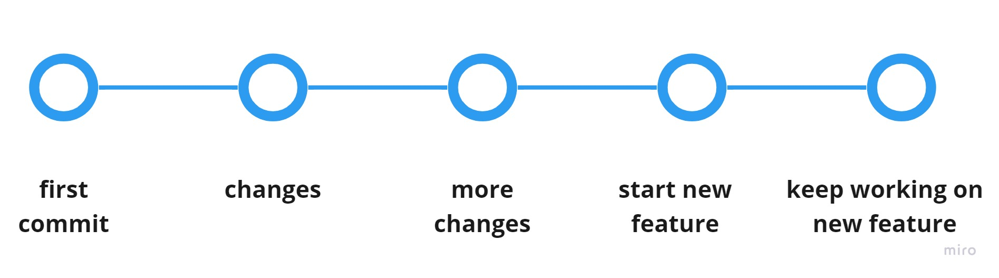

**[Branching](https://cs50.harvard.edu/web/2020/notes/1/)** is a method of moving into a new direction when creating a new feature, and only combining this new feature with the main part of your code, or the main branch, once you’re finished. What we need to do is have head point to our new development branch so that when we commit new items to our database, it will keep the master branch free of any unfinished and untested features.

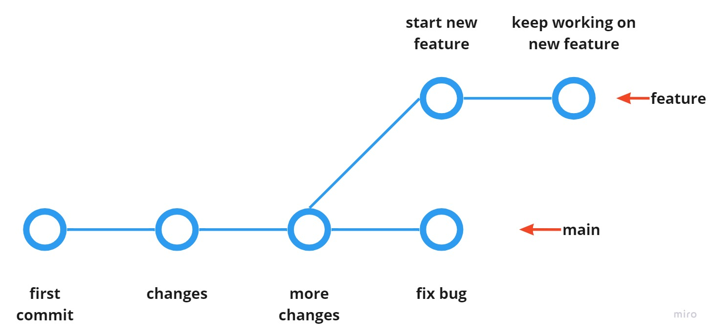

`git branch <branch name>`: creates a new branch of the project tree. 

`git checkout <branch name>`: switch to another branch

`HEAD`: pointer to the current branch being worked on. `git log` or `git status` or `git branch` will indicate which is the current branch. 
 
### Merging

`git merge`: combines the latest commits from two branches into one branch. 

Merge conflicts occur when two people attempt to change a file in ways that conflict with each other. Git will automatically change the file into a format that clearly outlines what the conflict is. Here’s an example where the same line was added in two different ways:

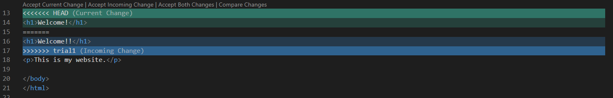

Edit the file to resolve the conflict. Run `git add`, `git commit` and `git merge` to complete the merge process.

### Reverting

The `revert` command will create a commit that reverts the changes of the commit being targeted. You can find the name of the commit you want to revert using `git log`.

```
git revert <commit hash>
```

```
$ git revert 7869f79d557a714cc4bacf4f180a571e52b13467
[tuesday 2714361] Revert "remove README"
 1 file changed, 0 insertions(+), 0 deletions(-)
 delete mode 100644 README.md
```
We can revert the latest commit using `git revert HEAD` (revert the latest change,  and then commit), adding the option `--no-edit` to skip the commit message editor (getting the default revert message):

```
$ git revert HEAD
[tuesday 30df8d1] Revert "Revert "remove README""
 1 file changed, 0 insertions(+), 0 deletions(-)
 create mode 100644 README.md
```
To revert to earlier commits, use `git revert HEAD~x` (x being a number. 1 going back one more, 2 going back two more, etc.)

## Containerization with Docker

Containers enable you to package your application in a portable way that can run in many environments. The most popular container platform is **Docker**.

### Docker Images

```
$ docker run hello-world
Unable to find image 'hello-world:latest' locally
latest: Pulling from library/hello-world
2db29710123e: Pull complete
Digest: sha256:10d7d58d5ebd2a652f4d93fdd86da8f265f5318c6a73cc5b6a9798ff6d2b2e67
Status: Downloaded newer image for hello-world:latest

Hello from Docker!
This message shows that your installation appears to be working correctly.

To generate this message, Docker took the following steps:
 1. The Docker client contacted the Docker daemon.
 2. The Docker daemon pulled the "hello-world" image from the Docker Hub.
    (amd64)
 3. The Docker daemon created a new container from that image which runs the
    executable that produces the output you are currently reading.
 4. The Docker daemon streamed that output to the Docker client, which sent it
    to your terminal.

To try something more ambitious, you can run an Ubuntu container with:
 $ docker run -it ubuntu bash

Share images, automate workflows, and more with a free Docker ID:
 https://hub.docker.com/

For more examples and ideas, visit:
 https://docs.docker.com/get-started/

```
1. At the terminal, when we type `docker run hello-world`, the client will contact the docker server.
2. The docker server will check for the local copy of the image `hello-world`. As there is no image in the image cache, the Docker server will download the image from Docker Hub (a public registry) and store it in the image cache.
3. A new container is created from the image and the program is executed which is to print out the message. 

### Dockerfile

`dockerfile` contains code to build the image. It is where you write the instructions to build a Docker image.

### Container Ports

[Docker tutorial](https://github.com/docker/getting-started)

**Run the following command** 

```
docker run -d -p 80:80 docker/getting-started
```

```
$ docker run -d -p 80:80 docker/getting-started
Unable to find image 'docker/getting-started:latest' locally
latest: Pulling from docker/getting-started
df9b9388f04a: Pull complete
5867cba5fcbd: Pull complete
4b639e65cb3b: Pull complete
061ed9e2b976: Pull complete
bc19f3e8eeb1: Pull complete
4071be97c256: Pull complete
79b586f1a54b: Pull complete
0c9732f525d6: Pull complete
Digest: sha256:b558be874169471bd4e65bd6eac8c303b271a7ee8553ba47481b73b2bf597aae
Status: Downloaded newer image for docker/getting-started:latest
e5bb7cffdf62bd41d3c3ecbe8f0f94d140098f8292b47e4b09a32a9f0d975c43

```
- `-d`: run the container in detached mode (in the background)
- `-p 80:80`: map port 80 of the host to port 80 in the container
- `docker/getting-started`: the image to use

Under ports, it is shown that port 80 is bound to container port 80. 
```
$ docker ps
CONTAINER ID   IMAGE                    COMMAND                  CREATED      STATUS          PORTS                NAMES
e5bb7cffdf62   docker/getting-started   "/docker-entrypoint.…"   7 days ago   Up 17 seconds   0.0.0.0:80->80/tcp   relaxed_dewdney
```

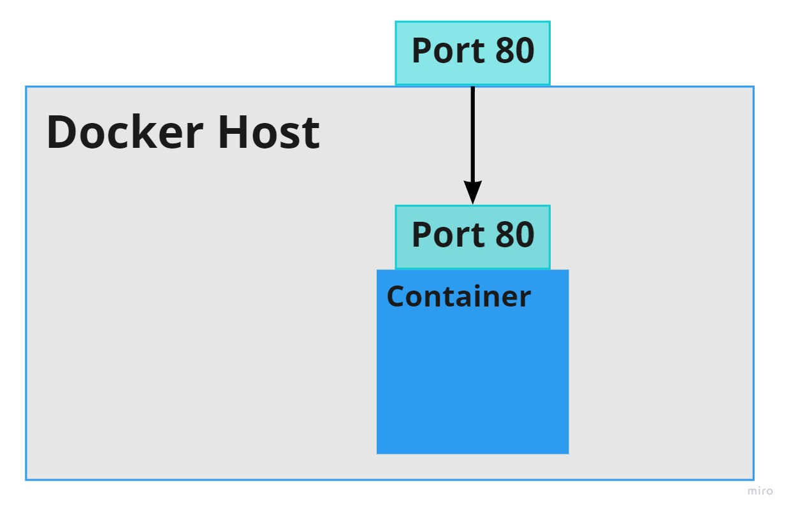

The container is listening on port 80. We can connect to the container using the port of the host which is specified as 80. 

### Container Volumes

Create a volume by using the `docker volume create` command.

```
docker volume create <Volume Name>
```
Start the container, add the `-v` flag to specify a volume mount. We will use the named volume and mount it to <Path>, which will capture all files created at the path.
```
docker run -v <Volume Name>:<Path> <Image Name>
```

```
docker volume inspect todo-db
[
    {
        "CreatedAt": "2022-04-28T10:17:43Z",
        "Driver": "local",
        "Labels": {},
        "Mountpoint": "/var/lib/docker/volumes/todo-db/_data",
        "Name": "todo-db",
        "Options": {},
        "Scope": "local"
    }
]
```
The `Mountpoint` is the actual location on the disk where the data is stored.

[Locating data volumes in windows](https://stackoverflow.com/questions/43181654/locating-data-volumes-in-docker-desktop-windows)


_[Back to the top](#table-of-contents)_