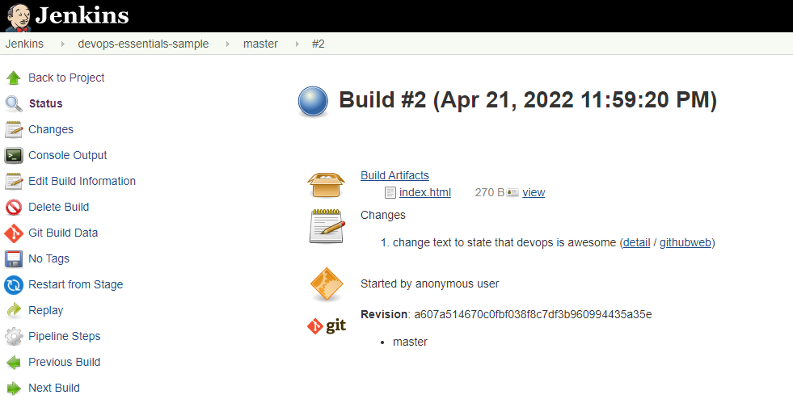

>[Back to Index](README.md)

### Table of contents
- [DevOps Theory and Practice](#devops-theory-and-practice)
  - [DevOps Culture](#devops-culture)
  - [DevOps Concepts and Practices](#devops-concepts-and-practices)
- [Source Control and Git](#source-control-and-git)
- [Containerization with Docker](#containerization-with-docker)

# DevOps Theory and Practice

## DevOps Culture

- [What is DevOps - AWS](https://aws.amazon.com/devops/what-is-devops/)

- [DevOps Life Cycle of Application](https://github.com/MichaelCade/90DaysOfDevOps/blob/main/Days/day05.md)

## DevOps Concepts and Practices

- [What is DevOps](https://webapp.io/blog/what-is-devops/)

- Build Automation: automation of the process of preparing code for deployment to a live environment. Depending on what languages are used, code needs to be compiled, linted, minified, transformed, 
unit tested, etc. Build automation means taking these steps and doing them in a consistent, automated way using a script or tool.

- [Continuous Integration](https://webapp.io/blog/what-is-ci/): the practice of frequently merging code changes done by developers

- [Continuous Delivery and Continuous Deployment](https://github.com/MichaelCade/90DaysOfDevOps/blob/main/Days/day70.md)
  
  Continuous Delivery: the practice of continuously maintaining code in a deployable state

  Continuous Deployment: the practice of frequently deploying small code changes to production

- [Infrastructure as Code](https://github.com/MichaelCade/90DaysOfDevOps/blob/main/Days/day56.md): manage and provision infrastructure through code and automation.

  Without infrastructure as code you might:
  - ssh into a host
  - Issue a series of commands to perform the change
  
  With infrastructure as code:
  - Change some code or configuration files that can be used with an automation tool to perform changes 
  - Commit them to source control
  - Use an automation tool to enact the changes defined in the code and/or configuration files

- Configuration Management: maintaining and changing the state of pieces of infrastructure in a consistent, maintainable, and stable way. Configuration management allows you to minimize configuration drift – the small changes that accumulate over time and make systems different from one another and harder to manage. 

- Orchestration: automation that supports processes and workflows, such as provisioning resources.

  - *Scalability* – Resources can be quickly increased or decreased to meet changing needs.
  - *Stability* – Automation tools can automatically respond to fix problems before users see them.
  - *Save time* – Certain tasks and workflows can be automated, freeing up engineers’ time.
  - *Self-service* – Orchestration can be used to offer resources to customers in a self-service fashion.
  - *Granular insight into resource usage* – Orchestration tools give greater insight into how many resources 
  are being used by what software, services, or customers.

- Monitoring: The collection and presentation of data about the performance and stability of services and infrastructure. Organizations monitor metrics and logs to see how application and infrastructure performance impacts the experience of their product’s end user. Monitoring tools collect data over things such as:
Usage of memory, cpu, disk i/o, Application logs, Network traffic.

- Microservices: The microservices architecture is a design approach to build a single application as a set of small services. Microservices are loosely coupled: Different microservices interact with each other using stable and 
well-defined APIs. 

  - *Modularity* – Microservices encourage modularity. In monolithic apps, individual pieces become tightly coupled, and complexity grows. Eventually, it’s very hard to change anything without breaking something. 

  - *Technological flexibility* – You don’t need to use the same languages and technologies for every part of the app. You can use the best tool for each job.

  - *Optimized scalability* – You can scale individual parts of the app based upon resource usage and load. With a monolith, you have to scale up the entire application, even if only one aspect of the service actually needs to be scaled.

### Create a DevOps Pipeline

1. **GitHub** (source control repository) is where the application code is stored.

2. **Staging Server** (Test Server) where we deploy our code to ensure the deployment works before going into Production Server.

3. **Continuous Integration**, CI Server is using Jenkins to orchstrate the process. It will take the code from GitHub and deploy to Staging and to Production.

**Execute the Initial Deployment**
Set up a Continuous Integration server by configuring the Jenkins project to look at the GitHub repo. 
Click Configure -> Branch Sources -> Project Repository to the GitHub repo URL -> Save

We will see Jenkins is scanning and building the branches from the repo.

Master branch represents code that is ready to be deployed to production. 

**Create a Pull Request**

On the production webpage, it is shown DevOps is great.

Back in GitHub, next to the new-feature branch, click New pull request. We need to merge the new feature branch into the master branch. 

Set the base fork: personal fork.

Set the base dropdown: master branch.

Set the compare dropdown: new-feature.

Below you will see the changes are displayed in a code comparison. Once ready, select Create pull request.

Select Merge pull request, and then Confirm merge.

Back in the Jenkins server, devops-esentials-sample -> master
On the new page, select build now from the sidebar. A new build will begin. *Build* is doing the build automation, *DeployToStage* deploys to staging server. When it gets to the *DeployToProd* stage, it will pause and wait for our input.

 

Check the staging webserver, we should see a page that says DevOps is awesome, which means the code pull is working correctly.

Back in the Jenkins window, hover over the *DeployToProd* and click Proceed.

 

Refresh our tab for the production webserver. We should see the updated text.

**Run the "Broken" Deployment**

Back on GitHub, click New pull request for the broken-feature branch.

Set the base fork: personal fork.

Set the base dropdown: master branch.

Set the compare dropdown: broken-feature.

Click Create pull request, then Merge pull request, and finally Confirm merge.

Back in the Jenkins tab, click Build Now. Once it gets to the DeployToProd stage, hover over that section and select Proceed. Refresh the tab with the production webserver IP address. We should see a misspelled word.

**Roll Back the Broken Deployment**

Back on the Jenkins page, click on build #2 -> Replay -> Run
On the Jenkins page, hover over the DeployToProd section, and select Proceed.
Once updated, our production webserver will show the correct text, meaning we have performed a successful rollback.

 

 

 

_[Back to the top](#table-of-contents)_