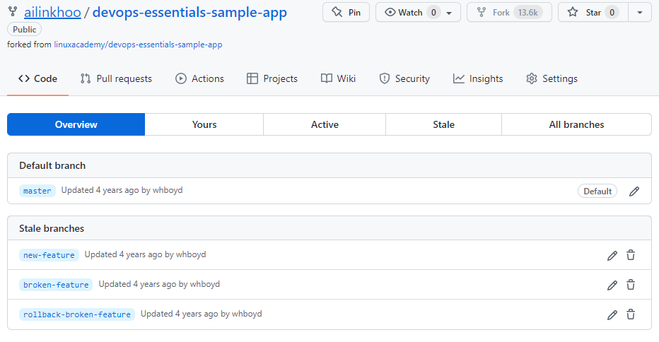

>[Back to Index](README.md)

### Table of contents
- [DevOps Theory and Practice](#devops-theory-and-practice)
  - [DevOps Culture](#devops-culture)
  - [DevOps Concepts and Practices](#devops-concepts-and-practices)
- [Source Control and Git](#source-control-and-git)
- [Containerization with Docker](#containerization-with-docker)

# DevOps Theory and Practice

## DevOps Culture

- [What is DevOps - AWS](https://aws.amazon.com/devops/what-is-devops/)

- [DevOps Life Cycle of Application](https://github.com/MichaelCade/90DaysOfDevOps/blob/main/Days/day05.md)

## DevOps Concepts and Practices

- [What is DevOps](https://webapp.io/blog/what-is-devops/)

- Build Automation: automation of the process of preparing code for deployment to a live environment. Depending on what languages are used, code needs to be compiled, linted, minified, transformed, 
unit tested, etc. Build automation means taking these steps and doing them in a consistent, automated way using a script or tool.

- [Continuous Integration](https://webapp.io/blog/what-is-ci/): the practice of frequently merging code changes done by developers

- [Continuous Delivery and Continuous Deployment](https://github.com/MichaelCade/90DaysOfDevOps/blob/main/Days/day70.md)
  
  - Continuous Delivery: the practice of continuously maintaining code in a deployable state
  - Continuous Deployment: the practice of frequently deploying small code changes to production

- [Infrastructure as Code](https://github.com/MichaelCade/90DaysOfDevOps/blob/main/Days/day56.md): manage and provision infrastructure through code and automation.

  Without infrastructure as code you might:
  - ssh into a host
  - Issue a series of commands to perform the change
  
  With infrastructure as code:
  - Change some code or configuration files that can be used with an automation tool to perform changes 
  - Commit them to source control
  - Use an automation tool to enact the changes defined in the code and/or configuration files

- Configuration Management: maintaining and changing the state of pieces of infrastructure in a consistent, maintainable, and stable way. Configuration management allows you to minimize configuration drift – the small changes that accumulate over time and make systems different from one another and harder to manage. 

- Orchestration: automation that supports processes and workflows, such as provisioning resources.

  - *Scalability* – Resources can be quickly increased or decreased to meet changing needs.
  - *Stability* – Automation tools can automatically respond to fix problems before users see them.
  - *Save time* – Certain tasks and workflows can be automated, freeing up engineers’ time.
  - *Self-service* – Orchestration can be used to offer resources to customers in a self-service fashion.
  - *Granular insight into resource usage* – Orchestration tools give greater insight into how many resources 
  are being used by what software, services, or customers.

- Monitoring: The collection and presentation of data about the performance and stability of services and infrastructure. Organizations monitor metrics and logs to see how application and infrastructure performance impacts the experience of their product’s end user. Monitoring tools collect data over things such as:
usage of memory, cpu, disk i/o, application logs, network traffic.

- Microservices: The microservices architecture is a design approach to build a single application as a set of small services. Microservices are loosely coupled: Different microservices interact with each other using stable and 
well-defined APIs. 

  - *Modularity* – Microservices encourage modularity. In monolithic apps, individual pieces become tightly coupled, and complexity grows. Eventually, it’s very hard to change anything without breaking something. 

  - *Technological flexibility* – You don’t need to use the same languages and technologies for every part of the app. You can use the best tool for each job.

  - *Optimized scalability* – You can scale individual parts of the app based upon resource usage and load. With a monolith, you have to scale up the entire application, even if only one aspect of the service actually needs to be scaled.


### Create a DevOps Pipeline


1. **GitHub** (source control repository) is where the application code is stored.

2. **Staging Server** (Test Server) where we deploy our code to ensure the deployment works before going into Production Server.

3. **Continuous Integration**, CI Server is using Jenkins to orchstrate the process. It will take the code from GitHub and deploy to Staging and then to Production.

**Execute the Initial Deployment**
Set up a Continuous Integration server by configuring the Jenkins project to look at the GitHub repo. 
Click Configure -> Branch Sources -> Project Repository to the GitHub repo URL -> Save


We will see Jenkins is scanning and building the branches from the repo.




Master branch represents code that is ready to be deployed to production. 


**Create a Pull Request**

On the production webpage, it is shown DevOps is great.

Back in GitHub, next to the new-feature branch, click New pull request. We need to merge the new feature branch into the master branch. 

Set the base fork: personal fork.

Set the base dropdown: master branch.

Set the compare dropdown: new-feature.


Below you will see the changes are displayed in a code comparison. Once ready, select Create pull request.


Select Merge pull request, and then Confirm merge.


Back in the Jenkins server, devops-esentials-sample -> master
On the new page, select build now from the sidebar. A new build will begin. *Build* is doing the build automation, *DeployToStage* deploys to staging server. When it gets to the *DeployToProd* stage, it will pause and wait for our input.

 

Check the staging webserver, we should see a page that says DevOps is awesome, which means the code pull is working correctly.

Back in the Jenkins window, hover over the *DeployToProd* and click Proceed.

 

Refresh our tab for the production webserver and we should see the updated text.

**Run the "Broken" Deployment**

Back on GitHub, click New pull request for the broken-feature branch.

Set the base fork: personal fork.

Set the base dropdown: master branch.

Set the compare dropdown: broken-feature.

Click Create pull request -> Merge pull request -> Confirm merge.

Back in the Jenkins tab, click Build Now. Once it gets to the DeployToProd stage, hover over that section and select Proceed. Refresh the tab with the production webserver. We should see a misspelled word.

**Roll Back the Broken Deployment**

Back on the Jenkins page, click on build #2 -> Replay -> Run
On the Jenkins page, hover over the DeployToProd section, and select Proceed.
Once updated, our production webserver will show the correct text, meaning we have performed a successful rollback.

 

 

 

# Source Control and Git

## The Basics of Using Git 

### Understanding the Git File System

`.git` is a hidden directory that is created when the current directory is transformed into a Git repository. It contains the configuration
information about our repository and all of the tracking information about all the files within the project directory.

`git add [filename]` selects that file, and moves it to the staging area, marking it for inclusion in the next commit.

A typical Git repository listing: 
```
Khoo Ai Lin@Ailin MINGW64 ~/Desktop/Cloud suport and devops/cloudpractice/devops/intake5_git_demo_fork (main)
$ ls .git/
COMMIT_EDITMSG  config  description  FETCH_HEAD  HEAD  hooks/  index  info/  logs/  objects/  packed-refs  refs/
```

### Creating a Local Repository

`git init`: initialize a new Git repository 

`git init --bare`: Create a new bare repository (a repository to be used as a remote repository only, that won't contain active development)

```
Khoo Ai Lin@Ailin MINGW64 ~/Desktop/Cloud suport and devops/cloudpractice/devops (main)
$ git init --bare big_project.git
Initialized empty Git repository in C:/Users/Khoo Ai Lin/Desktop/Cloud suport and devops/cloudpractice/devops/big_project.git/

Khoo Ai Lin@Ailin MINGW64 ~/Desktop/Cloud suport and devops/cloudpractice/devops (main)
$ ls -a big_project.git/
./  ../  config  description  HEAD  hooks/  info/  objects/  refs/
```

All of the repository information is in the root of this directory instead of `.git`. 


### Basic Configuration of Git

There are two main settings that you will need to have in place for your Git environment, and they are your name and your email address.
These particular settings are not used for any type of authentication mechanism. They are just used to add information to track who made changes to files. This is known as setting up your identity.

`$ git config --global user.name "[name]"`: Sets the name you want attached to your commit transactions

`$ git config --global user.email "[email address]"`: Sets the email you want attached to your commit transactions

`git config --list`: view configuration information for the git environment

```
Khoo Ai Lin@Ailin MINGW64 ~/Desktop/Cloud suport and devops/cloudpractice/devops/testing (master)
$ git config user.email "test@email.com"

Khoo Ai Lin@Ailin MINGW64 ~/Desktop/Cloud suport and devops/cloudpractice/devops/testing (master)
$ git config user.email
test@email.com

Khoo Ai Lin@Ailin MINGW64 ~/Desktop/Cloud suport and devops/cloudpractice/devops/testing (master)
$ cd

Khoo Ai Lin@Ailin MINGW64 ~ (main)
$ git config user.email
ailinkhoo11@gmail.com

```
We will set up the email address that we want to be used when tracking changes to this project. Notice that we did not use the `--global` option here as we only wanted to change the email address for this particular project, we also needed to be in this project's working directory in order to make this
change. We can test this by running the Git config command on email setting and here we see only the `test@email.com` address being used and if we go back to our home directory and check our email settings again, we see that Git will use the default one that we have set up in our global configuration file.

### Adding Files to a Project 

`git add [file]`: snapshots the file in preparation for versioning, adding it to the staging area.

`git status`: shows you what branch you're on, what files are in the working or staging directory, and any other important information.

```
$ git status
On branch master

No commits yet

Changes to be committed:
  (use "git rm --cached <file>..." to unstage)
        new file:   new-file
```
### The Status of Your Project

`git status -s`: view the output in shortened format
`A`: file has been added to the index
`??`: file is not tracked
`M`: file is modified
`git status -v`: shows more "verbose" detail including the textual changes of any uncommitted files

```
$ git status
On branch master

No commits yet

Changes to be committed:
  (use "git rm --cached <file>..." to unstage)
        new file:   new-file
        new file:   new_file2

Untracked files:
  (use "git add <file>..." to include in what will be committed)
        new_file3

$ git status -s
A  new-file
A  new_file2
?? new_file3
```
```
$ echo "SPYXFAMILY is so good ~" > new-file

$ git status -s
AM new-file
A  new_file2
?? new_file3

```
### Committing to Git 

Commits are the building blocks of "save points" within Git's version control. 

`git commit -m "<MESSGAE>"`: performs a commit with a specific message.
`git commit -am <MESSGAE>"`: In addition to including the commit message, this option allows you to skip the staging phase. The addition of `-a` will automatically stage any files that are already being tracked by Git (changes to files that you've committed before).

Git will take the first two characters of the SHA 1 hash value and create a directory under the objects directory.

```
$ git log
commit 9ff2aae193175fca3119c2cb9d65eb51f1f4005e (HEAD -> master)
Author: khooailin <test@email.com>
Date:   Mon Apr 25 22:55:19 2022 +0800

    Update to new_file3

commit 684f1e8377a91dcbf6f352cb5fe77a4a5af28263
Author: khooailin <test@email.com>
Date:   Mon Apr 25 22:54:35 2022 +0800

    Update to files
```
The file that contains the hash versions of our committed file's contents. As you can see, the files name consists of the rest of the hash value that we saw in our Git
log. Now these are binary files, so we cannot directly read them, but that's fine as Git keeps track of these files and their contents for us.

```
$ ls .git/objects/9f
f2aae193175fca3119c2cb9d65eb51f1f4005e
```

`git rm --cached <FILENAME>`: which we'll remove it from our index, but leave the actual file behind in our working directory.

```
$ git rm --cached sample-file
rm 'sample-file'

$ git status -s
D  sample-file
?? sample-file

$ ls
new_file2  new_file3  new-file  sample-file

$ git commit -m "delete sample-file"
[master c3526b9] delete sample-file
 1 file changed, 0 insertions(+), 0 deletions(-)
 delete mode 100644 sample-file
```

The `D` means the file is deleted. So in order to clean this up, we just need to run another commit.

### Ignoring Certain File Types

_[Back to the top](#table-of-contents)_