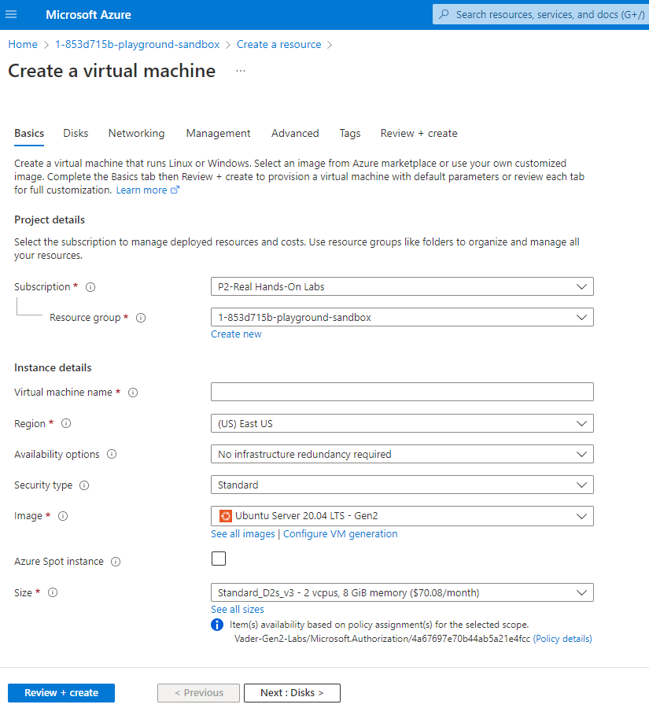

>[Back to Index](README.md)

### Table of contents
- [Introduction to Azure](#introduction-to-azure)
- [Cloud Concepts](#cloud-concepts)
- [Azure Architecture](#azure-architecture)
- [Compute](#compute)
- [Networking](#networking)
- [Storage](#storage)
- [Database](#database)
- [Authentication and Authorization](#authentication-and-authorization)
- [Azure Solutions](#azure-solutions)
- [Security](#security)
- [Privacy, Compliance and Trust](#privacy-compliance-and-trust)
- [Pricing](#pricing)
- [Support](#support)

# Introduction to Azure

- **Azure Portal**: Intuitive, visual one-stop shop for managing all your Azure resources.
- **Azure CLI**: A text-only way to manage Azure resources. A stable, structured way to manage your Azure environment.
- **Azure Powershell**: Fully supported by Azure with modules and cmdlets. A tool that fits into many different workflows.
- **Azure Cloud Shell**: Works from anywhere using a browser or mobile app. Many included tools and features, including storage.
- **Azure Mobile Apps**: Use the Android and iOS mobile apps to be alerted and respond to emergencies, or just perform general maintenance.
- **ARM Templates**: Use ARM templates to automate your infrastructure setup and avoid human mistakes. They are idempotent, can be put into source control, and are declarative.

# Cloud Concepts

1. **Language of Cloud Computing**: High availability, fault tolerance, disaster recovery, scalability, elasticity and agility. Describes stable
and dependable cloud computing, the ability to adapt to changes in resource demand, user base and application usage.
2. **Language of Cloud Economics**: CapEx and OpEx describe costs for computing. OpEx is cloud computing with a pay-as-you-go model.
3. **Cloud Service Models**: laaS, Paas and SaaS are cloud service models that pretty much all Azure products and services fall
under. **IaaS** gives you full control of all the features of your infrastructure, except for the actual hardware. You manage operating systems, networks, and application lifecycles. **PaaS** abstracts the platform-specific stuff, like operating system, and gives you a full platform to use,
such as data warehousing. **SaaS** is a software solution that you pay a monthly rental to use, such as your email, accounting system, or payment facilities.The shared responsibility model dictates whether you or Microsoft is responsible for a cloud service. 
4. **Azure Marketplace**: An extra layer of functionality for your cloud applications, by letting users use and integrate third-party products and services.
5. **Cloud Architecture Models**: Private, public and hybrid approaches to using cloud computing for your business.
Private cloud is Azure on your own hardware in a location of your choice. All the benefits of public cloud, but you can lock it down. A lot of staff
required. Public cloud is Azure, AWS, GCP. No uptront costs, but monthly usage. Little control over services and infrastructure. A hybrid cloud model is the best of private and public, but could be complex.

# Azure Architecture

**Azure Region**: A set of data centers that are close enough to each other that it doesn't matter which datacenter your data is in. Latency is the time it takes for data to travel. 
1. Each Region is Paired: Paired within same geographic area except Brazil South.
2. Outage Failover: If the primary region has an outage you can failover to the secondary region.
3. Planned Updates: Only one region inapair is updated at any one time.
4. Replication: Some services used paired regions for replication.

**Availability Zone**: Each availability zone (made up of one or more data centres) is a physical location within a region and each zone has its own separate power, cooling and networking. Used for protecting data from failures.

# Compute

Compute is any service that enables a computation in the cloud. 

1. **Virtual Machines**: Virtualized hardware you control. Spin up and down as needed. Take advantage of the Azure tools available. Priced per hour with many configurations available. 
2. **App Services**: Managed platform to host your applications. Web app, containers and API. Supports a lot of programming languages. 
3. **Azure Kubernetes Service**: Open-source tool for orchestrating and managing many container images and applications. Uses clusters and pods to scale and deploy applications.
4. **Scale Sets**: Sets of identical VMs. Scale sets automatically create and delete VMs for your application. Provides high availability and protects
against server failures. 

- Multiple VMs: Simple to manage multiple identical VMs using a load balancer.
- High Availability: If one VM fails or stops, the others in the scale set will keep working.
- Auto Scaling: Automatically match demand by adding or removing VMs from the scale set.
- Large Scale: Run up to 1000 VMs in a single scale set.

5. **Azure Container Instances**: Hosts and runs your containers on Azure. Containers have less overhead than virtual machines and can be deployed
consistently.
6. **Windows Virtual Desktop**: 100% virtualized Windows 10. Access with any device that has a browser and internet connection.
7. **Functions**: Serverless Azure offering. A piece of code that does one compute action each time it is invoked.

## Deploying Virtual Machine 

Create a virtual machine using the Azure portal. 



Download the private key to the local machine. [SSH](https://docs.microsoft.com/en-us/azure/virtual-machines/linux/ssh-from-windows) to the VM using the IP address. 

```
Khoo Ai Lin@Ailin MINGW64 ~/Desktop/Cloud suport and devops/cloudpractice/azure (main)
$ ssh -i ailin_key.pem azureuser@20.127.202.185
The authenticity of host '20.127.202.185 (20.127.202.185)' can't be established.
ED25519 key fingerprint is SHA256:q4Gn4I4ANFQuGyGk3DGcb3PtrhXLASAGeEnwn0AhMXs.
This key is not known by any other names
Are you sure you want to continue connecting (yes/no/[fingerprint])? yes
Warning: Permanently added '20.127.202.185' (ED25519) to the list of known hosts.
Welcome to Ubuntu 20.04.4 LTS (GNU/Linux 5.13.0-1023-azure x86_64)

 * Documentation:  https://help.ubuntu.com
 * Management:     https://landscape.canonical.com
 * Support:        https://ubuntu.com/advantage

  System information as of Wed May 11 06:34:48 UTC 2022

  System load:  0.0               Processes:             129
  Usage of /:   4.8% of 28.90GB   Users logged in:       0
  Memory usage: 3%                IPv4 address for eth0: 10.0.0.4
  Swap usage:   0%

1 update can be applied immediately.
To see these additional updates run: apt list --upgradable


The programs included with the Ubuntu system are free software;
the exact distribution terms for each program are described in the
individual files in /usr/share/doc/*/copyright.

Ubuntu comes with ABSOLUTELY NO WARRANTY, to the extent permitted by
applicable law.

To run a command as administrator (user "root"), use "sudo <command>".
See "man sudo_root" for details.

azureuser@ailin:~$ cat /etc/os-release
NAME="Ubuntu"
VERSION="20.04.4 LTS (Focal Fossa)"
ID=ubuntu
ID_LIKE=debian
PRETTY_NAME="Ubuntu 20.04.4 LTS"
VERSION_ID="20.04"
HOME_URL="https://www.ubuntu.com/"
SUPPORT_URL="https://help.ubuntu.com/"
BUG_REPORT_URL="https://bugs.launchpad.net/ubuntu/"
PRIVACY_POLICY_URL="https://www.ubuntu.com/legal/terms-and-policies/privacy-policy"
VERSION_CODENAME=focal
UBUNTU_CODENAME=focal
azureuser@ailin:~$ whoami
azureuser
```

# Networking

1. **Virtual Network**: A virtual network is a fundamental part of any Azure architecture. You can't have an Azure service that isn't somehow connected to a virtual network. A VNet has several properties. IP address range. Subnet is in a single region and a single subscription. You can scale VNets quickly, and they provide high availability too.
2. **Load Balancer**: A load balancer solves the problem of where to send traffic on a group of VMs running the same application. Based on IP address and port number, a load balancer will take incoming traffic and send it to a specific VM in the backend pool. Rules and health probes keep the load balancer and backend pool running smoothly.
3. **VPN gateway**: A VPN gateway connects your Azure infrastructure with your on-premises network. It is a specific type of virtual network gateway and is a secure way to connect your hybrid cloud solution.
4. **Application Gateway**: An application gateway is similar to a load balancer but can distribute incoming traffic based on HTTP request properties, such as URL, and host header values. This means traffic from the same session can go to multiple servers in the backend pool.
5. **EpressRoute**: An ExpressRoute connection is between your on-premises infrastructure and directly to Azure. It can enable a private, secure, high-bandwidth, low-latency connection. 
6. **Content Delivery Network**: A content delivery network, or CDN, stores a cached version of your application on edge nodes, which are servers close to the user. Your application will load faster,and less traffic will hit your main server. When content changes, caches are invalidated and updated. 

# Storage 

1. **Blob**: General storage for anything you'd like. Block, append and page varieties. Blob is inside a container, which is inside a storage account.
Hot, cool or archive price tiers.
2. **Disk**: A disk is generally attached to a VM. A managed storage service. Choose HDD, SSD, Premium SSD or Ultra Disk. They increase in speed and price while the latency go down.
3. **File**: Mitigating on-premises file storage solutions. Use to have highly available and super resilient storage that can be shared easily.
4. **Archive**: A very cheap way to store massive amounts of data. It is also a blob storage type.

# Database

- **Cosmos DB**: Globally distributed database. It is super fast and easy to manage. Scale to infinite performance and size. Can be costly!
- **Azure SQL**: Fully managed and using stable Microsoft SQL Technology. Compatible with on-premises SQL servers.
- **Azure Database for MYSQL**: A very popular community driven open-source database that is used in millions of applications. Very robust and stable.
- **Azure Database for PostgreSQL**: Also a very popular choice of relational database. Provides enterprise features like horizontal scaling. Azure offers a managed version.
- **Database Migration Services**: Migration of almost any kind of database to Azure SQL or SQL Server. Guides, step-by-step instructions, comprehensive documentation.

# Authentication and Authorization

- **Azure Active Directory** is a key part of identity services and you can't use Azure without it. Active Directory, AD, is not the same as Azure Active Directory, AAD. The former is the identity management solution for your on-premises implementation. And the latter is an Azure service for identity management. 
- **AAD** is the first service that is created on a new Azure account. 
- A **tenant** is a special instance of AAD. It is the first AAD instance that gets created when a new Azure account is set up. The tenant represents your organization and holds the users for it. A user can be a member or a guest of up to 500 tenants. 
A **subscription** is a billing entity. All Azure services belong to a subscription, which is what issues an invoice every month.
If a subscription stops, such as being unpaid, all the services within it stop too.
- Using AAD can help with your **hybrid cloud** set up and manage users across Azure and your on premises set up.
- **Multi-factor authentication** is an extra layer of security using something you know, something you have, and something you are.
- **Single sign-on**, SSO, with Azure AD lets your users use a single username and password to access all your enterprise apps in AAD.

# Azure Solutions

- **Internet of Things** is a network of millions of connected devices. Azure products create a managed and robust IoT solutions include IoT Hub, a Platform as a Service offering to collect and assemble all your data feeds from IoT devices, and IoT Central. The latter is a Software as a Service product that comes with tons of prepared data templates and dashboards to make sense of your IoT data. We also covered Azure Sphere, which is a native way of putting IoT solutions onto your IoT products and devices. 
- **Big data** is processing a very large collection of data. Businesses want to use this to provide better service, better products, and ultimately be more competitive and profitable. Azure offers the Data Lake Analytics and HDInsights products to store, analyze, and make sense of big data.
Cloud technology makes it feasible to analyze these vast datasets. For businesses, it can mean cost reduction, better decisions, and new products.
-**Machine learning** comes with connotations of robots taking over the world. But on Azure, it is a lot more benign and useful. You use models to train an artificial intelligence by having it play it over and over again. Usually put under the machine learning category, the main Azure product is the Machine Learning Studio. It has premade models and a range of tools to make AI a little bit easier.
- **Serverless** is an abstraction from servers. You are essentially using someone else's servers. You learned about three serverless Azure products. Azure Functions, which is a form of compute to run just a single function over and over again. Azure Logic Apps, which is a way to connect and integrate hundreds of different data feeds and applications. And finally, Event Grid, which is a network to pass events from application to application.
- **DevOps**: Azure DevOps, which consists of Azure Boards, Azure Pipelines, Azure Repos, Azure Test Plans, and Azure Artifacts. You can choose to use one or more of these in workflow. We also looked at Azure DevTest Labs, which is a way to set up development and test environments easily and consistently using templates. And, finally, GitHub and GitHub Actions are another option for your DevOps Pipeline.

# Security

- **Defense in depth** It isn't enough to have a single layer of defense. Azure provides several layers of security such as physical, identity, firewalls, and data. Each layer builds your defense in depth. We then went through some tools to secure the networks on Azure. 

-**Firewall** controls what data comes in, and out of a network. It does this with rules about the traffic. A DDoS attack is a lot of traffic
from many different machines to a single point. Azure protects against this type of attack through its global network with no down time to your application. Finally, a network security group can be used to protect a single subnet, or single virtual machine.

- The **Microsoft Defender for Cloud** is a portal within the Azure portal for you to monitor your security hygiene of all your Azure VM resources. You define policies, protect your resources more efficiently and can respond on any incidents.

- **Azure Key Vault** is a secure way to share access to applications and resources with third parties
without ever revealing any credentials. It scales globally, and keeps your keys and secrets secure.

- **Azure Information Protection** is a way to share files and data inside and outside of Azure, and still maintain control over that data. You can control who views, edits, prints, and more. 

- **Azure Sentinel**: Collect, aggregate, analyze and present security issues automatically for you to take action.

- **Azure Dedicated Hosts** is a piece of Azure hardware that you are in control of to run your VMs on. You are guaranteed that it will not have any other VMs running on it except the ones you created. And you can even decide, within reason, when to apply updates to the machine. You still get cloud benefits like availability zones, vault isolation, high availability, and skillsets.

- **Advanced threat protection** is a service to help you secure and manage users of your organization. Users are often the weakest link, and are targeted by attackers. ATP will monitor users' behavior, create a baseline of this behavior, and report on any anomalies from it. You can then make changes to policies and procedures based on this.


# Security

# Privacy, Compliance and Trust

# Pricing

# Support