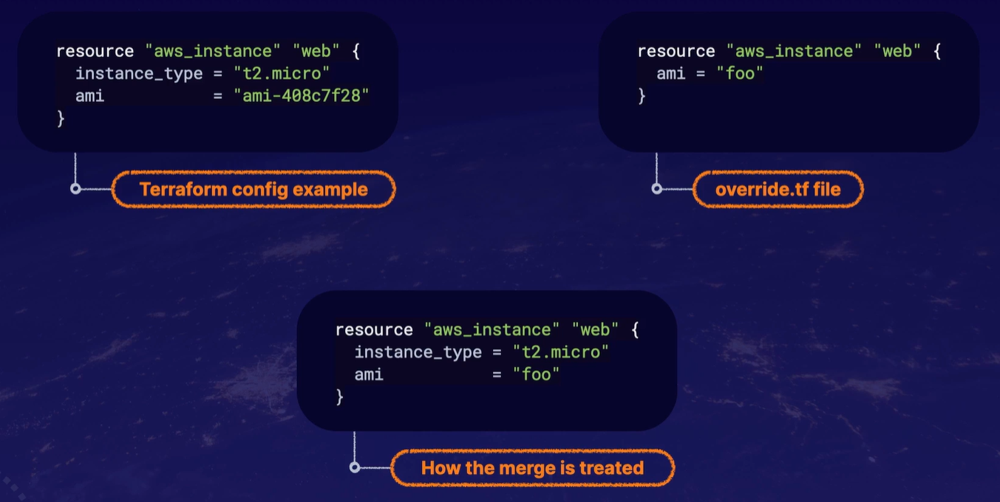
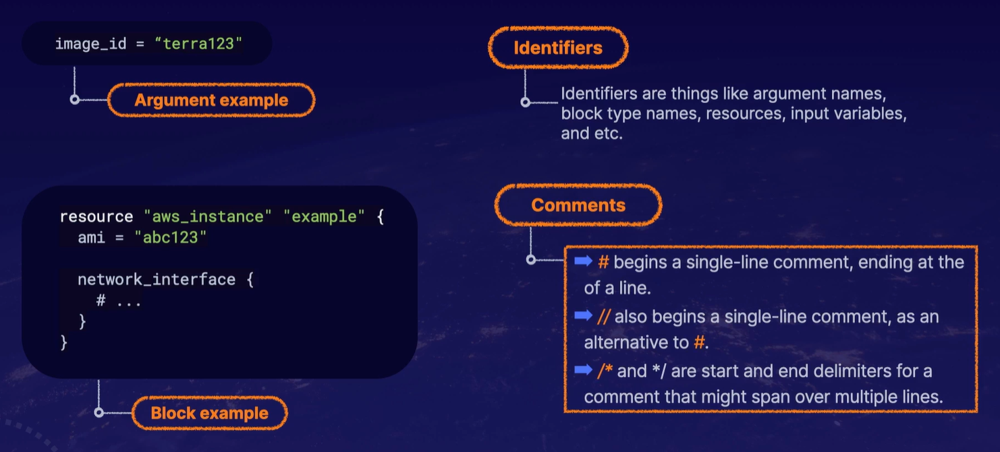
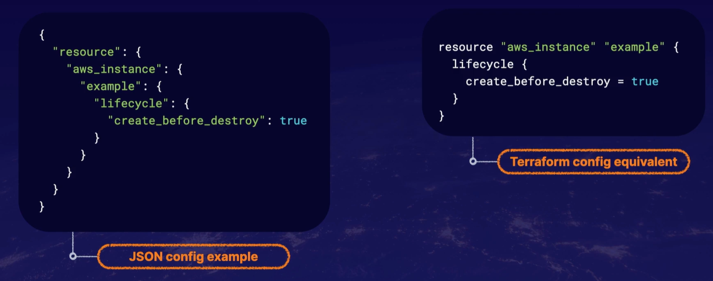

>[Back to Index](README.md)

### Table of contents

- [Terraform]
  - Terraform Fundamentals
  - Terraform Cloud

# Terraform 
## Terraform Fundamentals
### Terraform CLI

Terraform CLI is accessible via the `terraform` command.

`terraform -install-auto-complete`: auto-complete capabilities in the Terraform CLI.

Run the terraform command to see the full list of sub-commands. 

```
$ terraform
Usage: terraform [global options] <subcommand> [args]

The available commands for execution are listed below.
The primary workflow commands are given first, followed by
less common or more advanced commands.

Main commands:
  init          Prepare your working directory for other commands
  validate      Check whether the configuration is valid
  plan          Show changes required by the current configuration
  apply         Create or update infrastructure
  destroy       Destroy previously-created infrastructure

All other commands:
  console       Try Terraform expressions at an interactive command prompt
  fmt           Reformat your configuration in the standard style
  force-unlock  Release a stuck lock on the current workspace
  get           Install or upgrade remote Terraform modules
  graph         Generate a Graphviz graph of the steps in an operation
  import        Associate existing infrastructure with a Terraform resource
  login         Obtain and save credentials for a remote host
  logout        Remove locally-stored credentials for a remote host
  output        Show output values from your root module
  providers     Show the providers required for this configuration
  refresh       Update the state to match remote systems
  show          Show the current state or a saved plan
  state         Advanced state management
  taint         Mark a resource instance as not fully functional
  test          Experimental support for module integration testing
  untaint       Remove the 'tainted' state from a resource instance
  version       Show the current Terraform version
  workspace     Workspace management

Global options (use these before the subcommand, if any):
  -chdir=DIR    Switch to a different working directory before executing the
                given subcommand.
  -help         Show this help output, or the help for a specified subcommand.
  -version      An alias for the "version" subcommand.

```
**Popular Commands**

`terraform version`: find the version that you are running.

`terraform -chdir=<path_to/tf> <subcommand>`: Most of the time you would run the terraform command within your root module directory, where all your Terraform config files are. But if you want to run it outside of that directory, say if you were running some type of automation script that would kick off Terraform, you can simply use the `-chdir option`, and = the path to your root module directory, and then the sub-command.

`terraform init`: initialize a working directory containing your Terraform configuration files. This is the first command that you should run after writing your new Terraform configuration, or even when you clone an existing one from version control. This command is safe to run multiple times.

`terraform plan`: create an execution plan. You would run this after you initialize your directory. This is basically like a dry run for your Terraform configuration. It'll print out and show you exactly what your configuration is doing, or is intended to do.

`terraform apply`: apply all the changes in your configuration. 

`terraform destroy`: destroy the managed infrastructure. And then if, say, your environment is temporary, or you just need to start fresh, the command will destroy any infrastructure that was built with `terraform apply`.

**Plan, deploy and cleanup commands**

`terraform plan -out <plan_name>`: output a deployment plan. You can execute the terraform plan and use the `-out` flag, which will output your plan to a file. This is good to help troubleshoot.

`terraform plan -destroy`: output a destroy plan. It will do a dry run of any destroy to make sure that it gets rid of the resources that you intended to.

`terraform apply <plan_name>`: apply a specific plan.

`terraform apply -target=<resource name>`: only apply changes to a targeted resource. This way you're just applying changes to
a resource and not the infrastructure as a whole.

`terraform apply -var my_variable=<variable>`: pass a variable via the command line.

`terraform providers`: list out the providers that are being used in Terraform configuration.

### Configuration Language

Terraform language's main purpose is to declare resources.This represents infrastructure objects. All the different features are present to accommodate more flexible and convenient resource definition.

Syntax Consists of:
- *Blocks*: are containers for objects like resources.
- *Arguments*: assign a value to a name.
- *Expressions*: represent a value.

File Extension: Plain text files with the `.tf` file extension are where code in Terraform language is stored. You can also use a json variant of the language which uses the 
`.tf.json` file extension.

Text Encoding: These plain text files must use UTF-8encoding and usually use Unix-style line endings(LF), though it can also use Windows-style line endings(CRLF)as well.

Directories and Modules: Modules are a collection of `.tf` and/or `.tf.json` files kept together inadirectory.A module consists of only the top-level config files in the directory. A nested directory is treated as a separate module and may not be automatically included.

Root Module: Terraform configuration consists of a root module and a few child modules. The root module is the working directory where Terraform is invoked.

Override files override values in a configuration. The merge process replaces any values in the configuration with the values from the override file.





```
resource "aws_vpc" "main" {
  cidr_block = var.base_cidr_block
}

<BLOCK TYPE> "<BLOCK LABEL>" "<BLOCK LABEL>" {
  # Block body
  <IDENTIFIER> = <EXPRESSION> # Argument
}
```


### Working with Resources

Resources are the most important part of the Terraform language. Resource blocks describe infrastructure objects like virtual networks, compute instances, or components like DNS records.

```
resource "aws_instance" "web" {
  ami           = "ami-a1b2c3d4"
  instance_type = "t2.micro"
}
```
A `resource` block declares a resource of a given type ("aws_instance") with a given local name ("web"). The name is used to refer to this resource from elsewhere in the same Terraform module, but has no significance outside that module's scope.

The resource type and name together serve as an identifier for a given resource and so must be unique within a module.

Within the block body (between `{` and `}`) are the configuration arguments for the resource itself. Most arguments in this section depend on the resource type, and indeed in this example both `ami` and `instance_type` are arguments defined specifically for the `aws_instance` resource type.

**Resource Types**: 

*Providers*: plugins for Terraform that offers a collection of resources types. 

*Arguments*: specific to the selected resource type. 

*Documentation*: which every provider uses to describe its resource types and arguments. 

Terraform language defines several meta arguments which can be used with any resource type to change the behavior of the resource.

- `depends_on`: specify hidden dependencies. You would use this meta argument to handle hidden resource or module dependencies that Terraform can't automatically infer.
Now explicitly specifying a dependency is only necessary when a resource or module relies on some other resources behavior.

- `count`: create multiple resource instances according to count. 

- `for_each`: create multiple instances according to a map or a set of strings instead of a whole number. 

- `provider`: select a non-default provider configuration to use for a resource, which in turn would override Terraform's default behavior of selecting one based on the resource type name.

- `lifecycle`: set lifecycle customizations. Lifecycle block and its contents are meta arguments available for all resource blocks, regardless of type.

- `provisioner and connection`: take extra actiosn after resource creation. These can be used to be model specific actions on the local machine or on a remote machine
in order to prepare servers or other infrastructure objects for service. 

```
resource "aws_db_instance" "example" {
  # ...

  timeouts {
    create = "60m"
    delete = "2h"
  }
}
```
Some resource types provide special timeouts which are nested block arguments that allow for customization of how long certain operations are allowed to take before they are deemed failed. IFor example, we have the `aws_db_instance` which allows configurable timeouts for `create`, `update`, and `delete` operations.
Timeouts are handled entirely by the resource type implementation in the provider.
Here are 3 examples of the timeout strings that it'll accept. We have minutes, seconds, and hours. Here you can see on our timeouts our create is allowed 60 minutes while our delete is allowed 2 hours. The set of configurable operations is chosen by each resource type. Most resource types do not support the timeout blocks at all.
So you will need to check the documentation for each resource type to see what operations it offersfor configuration, if it allows any.

So how is the configuration applied? Well, when Terraform creates a new infrastructure object represented by a resource block, the identifier for that object is saved in Terraform state which allows it to be updated and destroyed in response to future changes. For a resource block that already has an associated infrastructure object in the state, Terraform compares the actual configuration of the object where the arguments given in the configuration and if necessary, updates the object to match the configuration. 

Terraform will `create` the resources that exist in the configuration, but are not associated with the real infrastructure objects in the state. It then looks to `destroy` resources that exist in the state but no longer exist in the configuration. Then it looks to `update in-place`. So `update in-place` resources whose arguments have changed. And then it'll look to `destroy and re-create` resources whose arguments have changed which cannot be updated in-place due to remote API and limitations. Now this general behavior applies for all resources, regardless of type. The details of what it means to create, update, or destroy a resource are different for each resource type, but this standard set of verbs is common across them all. 


**Accessing Resource Attributes**

- Expressions within Terraform modules

- Read-only attributes with information obtained from remote APIs

- Provider-included data sources


**Resource Dependencies**

- Most resource dependencies are handled automatically. 

- Terraform analyzes any expressions within a resource block to find references to other objects, and treats those references as ordering requirements when `creating`, `updating`, or `destroying` resources. 

- It's usually not necessary to manually specify dependencies between resources,however some dependencies cannot be recognized implicitly in the configuration.
